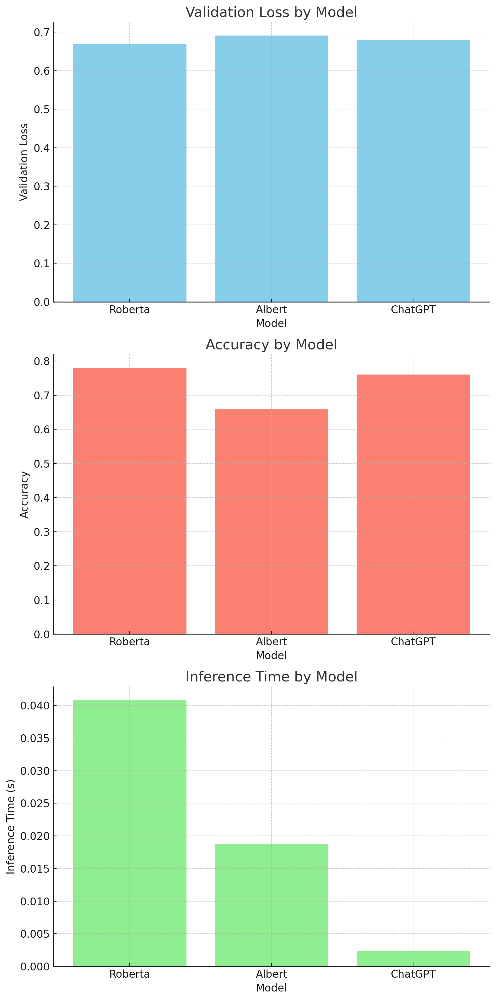

# LatencySolver

## Overview
This research project focuses on reducing the latency of machine learning models while maintaining or improving their performance. Various techniques, including pruning, quantization, dynamic layer skipping, and low-rank factorization, are explored and applied to different models. The models experimented with include Roberta, Albert, and ChatGPT.

## Techniques Used
- **Pruning**: Removing less significant connections in the network to reduce the model size and inference time.
- **Quantization**: Converting the model weights from floating-point to lower precision to speed up inference.
- **Dynamic Layer Skipping**: Randomly skipping certain layers during inference to reduce computation.
- **Low-Rank Factorization**: Decomposing weight matrices into lower-rank matrices to reduce the number of parameters and computation.

## Experimental Results
The models were evaluated on the SuperGLUE BoolQ dataset. Below are the results:

### Roberta
- **Validation Loss**: 0.668457
- **Accuracy**: 0.78
- **Inference Time**: 0.040804 seconds
- **Quantized Model Results**: 
  - **Evaluation Loss**: 0.655232
  - **Evaluation Accuracy**: 0.78
  - **Evaluation Runtime**: 0.2111 seconds
  - **Evaluation Samples per Second**: 236.816
  - **Evaluation Steps per Second**: 33.154

### Albert
- **Validation Loss**: 0.691212
- **Accuracy**: 0.66
- **Inference Time**: 0.018711 seconds
- **Quantized Model Results**: 
  - **Evaluation Loss**: 0.691451
  - **Evaluation Accuracy**: 0.66
  - **Evaluation Runtime**: 0.2087 seconds
  - **Evaluation Samples per Second**: 239.564
  - **Evaluation Steps per Second**: 33.539

### ChatGPT
- **Validation Loss**: 0.679919
- **Accuracy**: 0.76
- **Inference Time**: 0.002375 seconds
- **Quantized Model Results**: 
  - **Evaluation Loss**: 0.666115
  - **Evaluation Accuracy**: 0.76
  - **Evaluation Runtime**: 0.1276 seconds
  - **Evaluation Samples per Second**: 391.844
  - **Evaluation Steps per Second**: 54.858

## Visual Results


## Next Steps
1. **Optimization**: Further optimize ChatGPT, as it shows promising inference times with competitive accuracy. Fine-tune the hyperparameters for Roberta to potentially reduce inference time while maintaining accuracy.
2. **Additional Techniques**: Explore additional compression techniques like quantization-aware training or mixed-precision training to further reduce inference time without compromising accuracy. Implement advanced pruning methods to see if further improvements in model size and inference speed can be achieved.

## How to Run the Experiments
1. **Install dependencies**:
   ```bash
   pip install datasets transformers optuna safetensors cohere
   git clone https://github.com/notrealzapa/LatencySolver.git
   cd LatencySolver
   python final_latency.py


